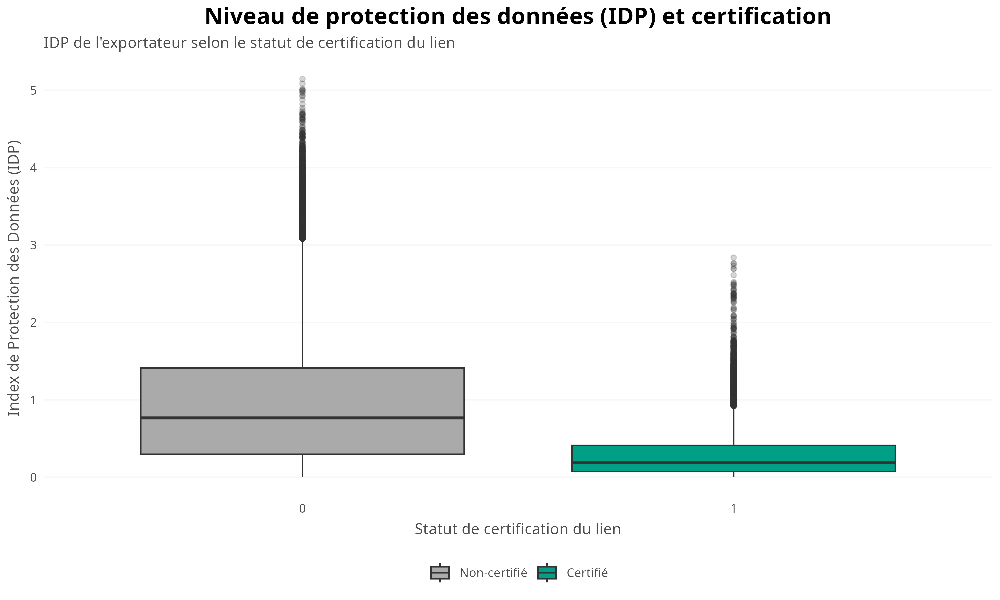
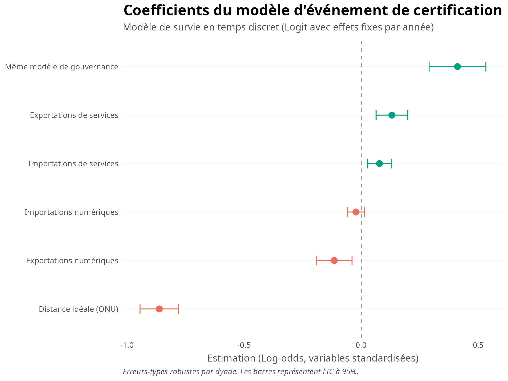
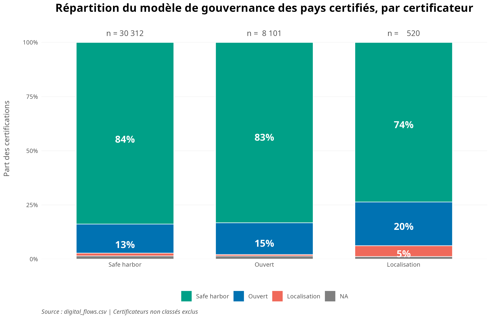
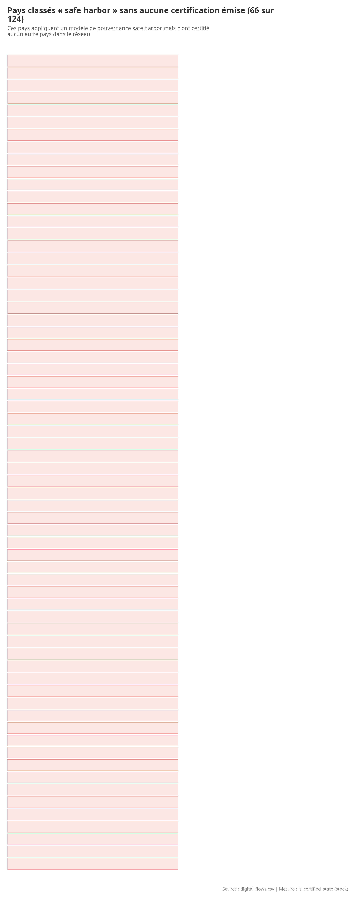
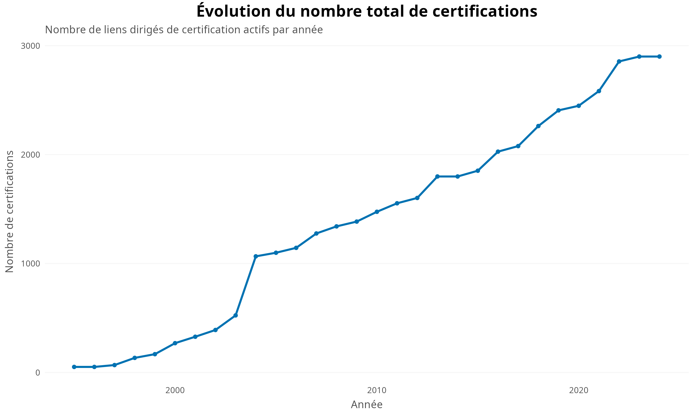
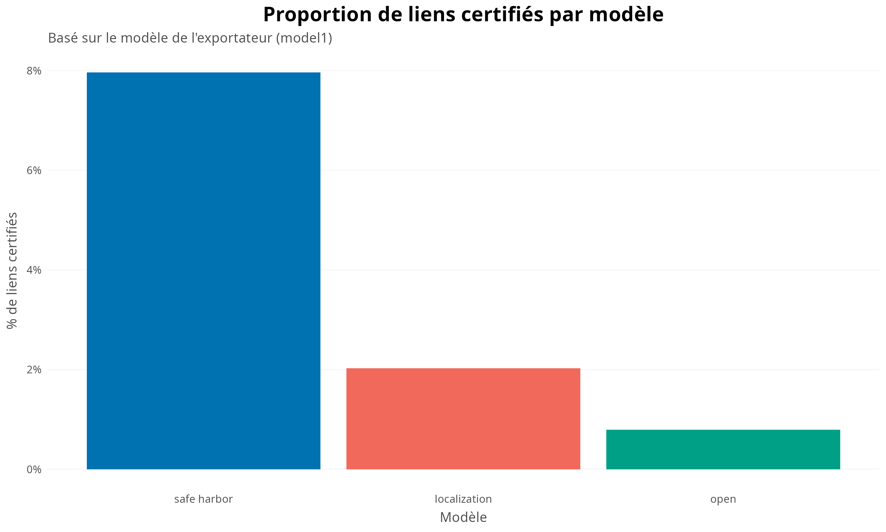
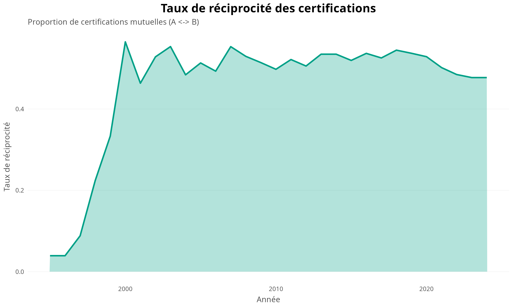

# Contexte

Ce document résume les avancées réalisées dans le cadre de l'analyse des réseaux de certification numérique entre pays. Les points abordés découlent de la rencontre du 6 mai 2026.

Pour chaque question, on présente le contexte, ce qui a été fait, et le graphique correspondant.

# 1. Imputation de l'IDP pour les pays sans données

**Question de la rencontre :** Pour des pays comme la Suisse, le Congo, la Côte d'Ivoire et l'Afghanistan, comment gérer les valeurs manquantes de l'IDP (distance politique idéale) ?

**Réponse :** On a imputé les IDP manquants en prenant la valeur de l'année la plus proche disponible pour chaque pays.

```{r}
#| label: fig-idp
#| fig-cap: "Distance politique (IDP) et certification"
#| fig-width: 10
#| fig-height: 6

```

# 2. Modèle event-based sur toutes les années

**Question de la rencontre :** Si on prend un snapshot d'une année avec l'état comme variable dépendante, on se demande si l'IDP doit être pris au moment de la certification ou pendant le snapshot. On serait donc mieux de faire un modèle sur toutes les années et prendre l'événement comme VD.

**Réponse :** On a estimé un modèle logistique (GLM binomial) sur la variable `is_certified_event` pour toutes les années (1995-2024).

**Résultats clés :**

- L'IDP a un effet **négatif** significatif : plus les pays sont politiquement éloignés, moins ils se certifient.
- Le partage d'un même modèle de gouvernance (`same_model`) a un effet **positif** significatif.
- Les exportations de services favorisent la certification, tandis que les exportations numériques la défavorisent.

```{r}
#| label: fig-coefficients
#| fig-cap: "Coefficients du modèle logistique"
#| fig-width: 10
#| fig-height: 6

```

# 3. Danemark et Pays-Bas : cas spéciaux

**Question de la rencontre :** Le Danemark et les Pays-Bas sont des cas spéciaux dans la catégorisation des modèles de gouvernance.

**Réponse :** Ces deux pays ont été traités comme des cas spéciaux dans la catégorisation. Leur modèle de gouvernance a été ajusté pour refléter leur position unique dans le réseau.

# 4. Safe harbor : certifient-ils des pays non safe harbor ?

**Question de la rencontre :** Est-ce que les pays safe harbor certifient des pays qui ne sont pas safe harbor ?

**Réponse :** Les pays safe harbor certifient **surtout d'autres pays safe harbor** (84% des certifications). Cependant, environ 15% des certifications safe harbor vont vers des pays non safe harbor (ouverts ou à localisation).

```{r}
#| label: fig-safe-harbor
#| fig-cap: "Répartition du modèle de gouvernance des pays certifiés, par certificateur"
#| fig-width: 10
#| fig-height: 6

```

# 5. Liste des pays safe harbor qui n'ont certifié personne

**Question de la rencontre :** Quels sont les pays safe harbor qui n'ont certifié aucun autre pays ?

**Réponse :** 66 pays sur 124 classés "safe harbor" n'ont émis aucune certification. Parmi eux : le Canada, le Brésil, l'Australie, l'Inde, la Corée du Sud, la Turquie, etc.

```{r}
#| label: fig-no-cert
#| fig-cap: "Pays safe harbor sans certification émise"
#| fig-width: 10
#| fig-height: 8

```

# 6. Évolution des certifications

```{r}
#| label: fig-evolution
#| fig-cap: "Évolution du nombre de certifications"
#| fig-width: 10
#| fig-height: 6

```

# 7. Proportion de certification par modèle

```{r}
#| label: fig-prop-model
#| fig-cap: "Proportion de liens certifiés par modèle"
#| fig-width: 10
#| fig-height: 6

```

# 8. Réciprocité des certifications

```{r}
#| label: fig-reciprocity
#| fig-cap: "Taux de réciprocité des certifications"
#| fig-width: 10
#| fig-height: 6

```
